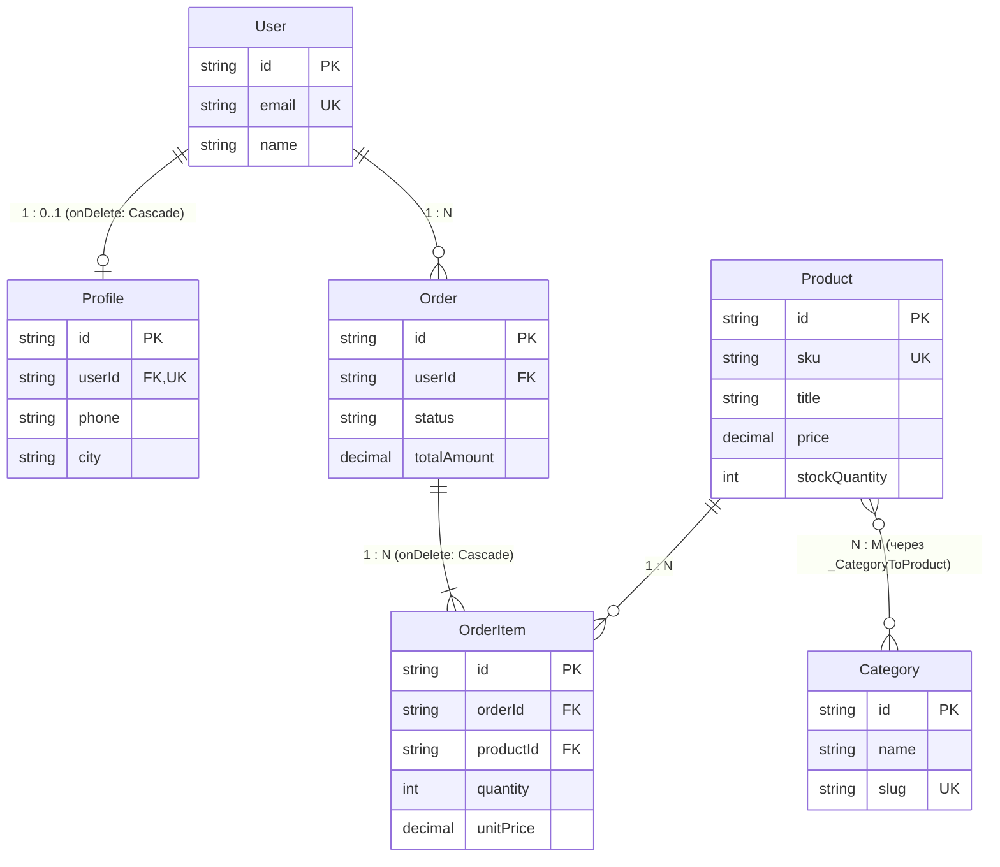

# 📋 Підсумки роботи: Day 3 — Реляційні бази даних, SQL-зв'язки (1:1, 1:N, N:M), ORM Prisma 7, Міграції та Seeding

Цей документ містить повний звіт про виконану роботу в рамках **Day 3**, детальний аналіз архітектурних рішень, розбір реляційних моделей даних, особливості оновленої архітектури **Prisma 7**, аналіз згенерованого SQL DDL, реалізацію скрипта початкового наповнення (**Seeding**) та відповіді на концептуальні питання щодо баз даних і проєктування схеми для технічних інтерв'ю.

---

## 📑 Зміст
1. [Огляд завдань](#-огляд-завдань)
2. [Блок 1: Проєктування реляційної схеми даних (Prisma Schema)](#-блок-1-проєктування-реляційної-схеми-даних)
3. [Блок 2: Кардинальність зв'язків: 1:1, 1:N, N:M у теорії та практиці](#-блок-2-кардинальність-звязків-11-1n-nm)
4. [Блок 3: Архітектура Prisma 7, Driver Adapters та конфігурація](#-блок-3-архітектура-prisma-7-driver-adapters-та-конфігурація)
5. [Блок 4: Міграції бази даних та аналіз SQL DDL Constraints](#-блок-4-міграції-бази-даних-та-аналіз-sql-ddl-constraints)
6. [Блок 5: Наповнення бази тестовими даними (Seeding)](#-блок-5-наповнення-бази-тестовими-даними-seeding)
7. [Блок 6: Чистота Git-репозиторію та артефакти генерації (generated/)](#-блок-6-чистота-git-репозиторію-та-артефакти-генерації)
8. [🎯 Відповіді на питання для самоперевірки та інтерв'ю](#-відповіді-на-питання-для-самоперевірки-та-інтервю)

---

## 🎯 Огляд завдань

Головна мета Day 3 — інтегрувати бекенд-сервіс із реальною реляційною базою даних PostgreSQL, розгорнутою у Docker-контейнері:
* **Проєктування реляційної схеми:** моделювання сутностей e-commerce системи (`User`, `Profile`, `Product`, `Category`, `Order`, `OrderItem`) з усіма типами зв'язків (1:1, 1:N, N:M).
* **Суворе обмеження типів:** захист від дублікатів через унікальні індекси (`@unique`), налаштування фінансових полів через `Decimal`, валідація статусів через переліки (`enum`).
* **Управління схемою через міграції:** перенесення декларативної схеми Prisma у фізичні таблиці PostgreSQL за допомогою версіонованих міграцій.
* **Каскадне видалення та референційна цілісність:** налаштування правил `ON DELETE CASCADE` для запобігання появі "осиротілих" записів (orphaned records).
* **Автоматизований Seeding:** написання скрипта для наповнення бази 6 категоріями, 10 користувачами з профілями, 50 товарами та зв'язаними тестовими замовленнями.

---

## 🗄️ Блок 1: Проєктування реляційної схеми даних

### Що було зроблено:
У файлі [schema.prisma](file:///home/bohdan/MyProjects/test_projects/order-inventory-service/server/prisma/schema.prisma) спроєктовано 6 взаємопов'язаних моделей e-commerce домену:

```prisma
model User {
  id        String    @id @default(uuid())
  email     String    @unique
  name      String
  createdAt DateTime  @default(now())
  updatedAt DateTime  @updatedAt
  profile   Profile?
  orders    Order[]
}

model Profile {
  id      String  @id @default(uuid())
  phone   String?
  city    String?
  address String?
  avatar  String?
  userId  String  @unique
  user    User    @relation(fields: [userId], references: [id], onDelete: Cascade)
}

model Product {
  id            String      @id @default(uuid())
  sku           String      @unique
  title         String
  price         Decimal     @default(0) @db.Decimal(10, 2)
  stockQuantity Int         @default(0)
  categories    Category[]
  orderItems    OrderItem[]
  createdAt     DateTime    @default(now())
  updatedAt     DateTime    @updatedAt
}

model Category {
  id       String    @id @default(uuid())
  name     String
  slug     String    @unique
  products Product[]
}

enum OrderStatus {
  PENDING
  PAID
  SHIPPED
  COMPLETED
  CANCELLED
}

model Order {
  id          String      @id @default(uuid())
  userId      String
  user        User        @relation(fields: [userId], references: [id], onDelete: Cascade)
  status      OrderStatus @default(PENDING)
  totalAmount Decimal     @default(0) @db.Decimal(10, 2)
  items       OrderItem[]
  createdAt   DateTime    @default(now())
  updatedAt   DateTime    @updatedAt

  @@index([userId])
}

model OrderItem {
  id        String   @id @default(uuid())
  orderId   String
  order     Order    @relation(fields: [orderId], references: [id], onDelete: Cascade)
  productId String
  product   Product  @relation(fields: [productId], references: [id])
  quantity  Int      @default(1)
  unitPrice Decimal  @default(0) @db.Decimal(10, 2)

  @@index([orderId])
  @@index([productId])
}
```

### Ключові проєктні рішення:
1. **UUID замість автоінкрементних цілих чисел (`Int @default(autoincrement())`):**
   * Числові ID розкривають бізнес-інформацію (конкурент може бачити, скільки замовлень створено: `order/1` vs `order/2`).
   * UUID можна генерувати на клієнті або в бекенді ще до збереження в базу даних, що значно спрощує розподілені системи та роботу черг.
2. **Тип `DateTime` замість `Timestamp`:**
   * У Prisma скалярний тип для міток часу називається `DateTime`. Prisma автоматично компілює його у `TIMESTAMP(3)` в PostgreSQL. Модифікатор `@updatedAt` автоматично оновлює значення при кожній операції `UPDATE`.
3. **Фінансова точність `Decimal(10, 2)`:**
   * Категорично заборонено використовувати `Float` або `Double` для фінансових сум через похибки округлення чисел з рухомою комою у двійковій системі ($0.1 + 0.2 \neq 0.3$). Тип `Decimal` забезпечує точність до 2 знаків після коми без втрати копійок.

---

## 🔗 Блок 2: Кардинальність зв'язків: 1:1, 1:N, N:M

| Тип зв'язку | Сутності в проєкті | Фізична реалізація в PostgreSQL | Призначення |
| :--- | :--- | :--- | :--- |
| **`1:1` (One-to-One)** | `User` $\leftrightarrow$ `Profile` | Зовнішній ключ `Profile.userId` з обмеженням **`UNIQUE INDEX`**. | Розвантаження головної таблиці `User`; ліниве завантаження додаткових персональних даних. |
| **`1:N` (One-to-Many)** | `User` $\leftrightarrow$ `Order` | Зовнішній ключ `Order.userId` **без** `UNIQUE`. | Зв'язування клієнта з історією його покупок. |
| **`1:N` (One-to-Many)** | `Order` $\leftrightarrow$ `OrderItem` | Зовнішній ключ `OrderItem.orderId` **без** `UNIQUE`. | Одне замовлення розпадається на перелік товарних позицій. |
| **`N:M` (Many-to-Many)** | `Product` $\leftrightarrow$ `Category` | Окрема з'єднувальна таблиця **`_CategoryToProduct`** із двома FK `("A", "B")`. | Товар може належати багатьом категоріям, категорія містить тисячі товарів. |
| **`N:M` з даними** | `Order` $\leftrightarrow$ `Product` через `OrderItem` | Явна сутність `OrderItem` із власними атрибутами `quantity` та `unitPrice`. | Фіксація ціни товару на момент оформлення (історичність фінансових даних). |



---

## ⚡ Блок 3: Архітектура Prisma 7, Driver Adapters та конфігурація

У новій версії **Prisma 7** відбулися фундаментальні архітектурні зміни, які було впроваджено в наш проєкт:

### 1. Відмова від монолітного Rust Query Engine
Раніше Prisma завантажувала важкий нативний Rust-бінарник (`query-engine`). У Prisma 7 за замовчуванням використовується новий генератор `provider = "prisma-client"` (Rust-free), який працює через нативні драйвери Node.js / JavaScript.

### 2. Обов'язковість Driver Adapters
Для підключення до PostgreSQL через новий клієнт обов'язково використовується адаптер драйвера. Було встановлено пакети:
```bash
npm install @prisma/adapter-pg pg
npm install -D @types/pg
```
Ініціалізація клієнта тепер виконується з явним передаванням пулу з'єднань:
```typescript
import { PrismaPg } from '@prisma/adapter-pg';
import { PrismaClient } from '../src/generated/prisma/client.js';

const adapter = new PrismaPg({ connectionString: process.env.DATABASE_URL });
const prisma = new PrismaClient({ adapter });
```

### 3. Файл конфігурації `prisma7.config.ts`
Усі глобальні параметри міграцій та джерела даних винесено з `schema.prisma` у файл [prisma7.config.ts](file:///home/bohdan/MyProjects/test_projects/order-inventory-service/server/prisma7.config.ts):
```typescript
import dotenv from 'dotenv';
import { defineConfig } from 'prisma/config';

// Завантаження змінних із кореневого каталогу мікросервісу
dotenv.config({ path: '../.env' });

export default defineConfig({
  schema: 'prisma/schema.prisma',
  migrations: {
    path: 'prisma/migrations',
    seed: 'tsx prisma/seed.ts',
  },
  datasource: {
    url: process.env['DATABASE_URL'],
  },
});
```

---

## 🚀 Блок 4: Міграції бази даних та аналіз SQL DDL Constraints

### Генерація міграції:
Командою `npx prisma migrate dev --name init` створено першу ревізію міграції у файлі [migration.sql](file:///home/bohdan/MyProjects/test_projects/order-inventory-service/server/prisma/migrations/20260905104022_init/migration.sql).

### Аналіз згенерованого SQL DDL:
1. **Обмеження первинного ключа (`PRIMARY KEY`):**
   ```sql
   CONSTRAINT "User_pkey" PRIMARY KEY ("id")
   ```
   Гарантує унікальність рядка та автоматично будує B-Tree індекс для миттєвого пошуку за ідентифікатором за час $O(\log N)$.

2. **Обмеження зовнішнього ключа (`FOREIGN KEY`) та каскадне видалення:**
   ```sql
   ALTER TABLE "Profile" 
     ADD CONSTRAINT "Profile_userId_fkey" 
     FOREIGN KEY ("userId") REFERENCES "User"("id") 
     ON DELETE CASCADE ON UPDATE CASCADE;
   ```
   * **`ON DELETE CASCADE`:** Якщо користувача з `id = "abc"` видалити, база автоматично видалить рядок профілю з `userId = "abc"`. Це запобігає виникненню "мертвих" записів без власника.
   * **`ON DELETE RESTRICT`:** Для `Order` відносно `User` або `OrderItem` відносно `Product` застосовано захист: не можна випадково видалити товар із каталогу, якщо він уже присутній в історії замовлень клієнтів.

3. **Створення проміжної таблиці зв'язку N:M:**
   ```sql
   CREATE TABLE "_CategoryToProduct" (
       "A" TEXT NOT NULL,
       "B" TEXT NOT NULL,
       CONSTRAINT "_CategoryToProduct_AB_pkey" PRIMARY KEY ("A","B")
   );
   CREATE INDEX "_CategoryToProduct_B_index" ON "_CategoryToProduct"("B");
   ```
   * Складений первинний ключ `("A", "B")` гарантує, що товар не може бути двічі прив'язаний до однієї категорії.
   * Окремий індекс на колонку `B` гарантує, що запити на кшталт «показати всі категорії товару» та «показати всі товари в категорії» виконуватимуться однаково швидко.

---

## 🌱 Блок 5: Наповнення бази тестовими даними (Seeding)

### Що було зроблено:
1. Написано скрипт [server/prisma/seed.ts](file:///home/bohdan/MyProjects/test_projects/order-inventory-service/server/prisma/seed.ts).
2. Реалізовано ідемпотентне очищення бази перед кожним запуском. **Порядок видалення строго враховує Foreign Key Constraints**:
   ```typescript
   await prisma.orderItem.deleteMany();
   await prisma.order.deleteMany();
   await prisma.profile.deleteMany();
   await prisma.user.deleteMany();
   await prisma.product.deleteMany();
   await prisma.category.deleteMany();
   ```
   *(Якщо спробувати спочатку видалити `User`, база викине помилку `ForeignKeyViolation`, тому що на нього посилаються записи в `Order`).*
3. Створено:
   * **6 категорій:** *Електроніка, Комп’ютери, Смартфони, Побутова техніка, Одяг, Книги*.
   * **10 користувачів:** з валідними профілями 1:1, містами (*Київ, Львів, Одеса, Харків, Дніпро тощо*), адресами та аватарами.
   * **50 реалістичних товарів:** з унікальними артикулами (SKU), цінами від $22.00$ до $3499.99$, складськими залишками та зв'язками з категоріями через `categories.connect`.
   * **6 замовлень:** із різними бізнес-статусами (`COMPLETED`, `PAID`, `SHIPPED`, `PENDING`, `CANCELLED`) та позиціями `OrderItem`.
4. У [package.json](file:///home/bohdan/MyProjects/test_projects/order-inventory-service/server/package.json) налаштовано команду:
   ```json
   "scripts": {
     "seed": "prisma db seed"
   }
   ```

### Фактичний аудит наповнення бази в PostgreSQL:
```sql
SELECT 
  (SELECT count(*) FROM "User") AS users_count,
  (SELECT count(*) FROM "Profile") AS profiles_count,
  (SELECT count(*) FROM "Category") AS categories_count,
  (SELECT count(*) FROM "Product") AS products_count,
  (SELECT count(*) FROM "_CategoryToProduct") AS product_categories_relations,
  (SELECT count(*) FROM "Order") AS orders_count,
  (SELECT count(*) FROM "OrderItem") AS order_items_count;
```

**Результат виконання:**
```text
 users_count | profiles_count | categories_count | products_count | product_categories_relations | orders_count | order_items_count 
-------------+----------------+------------------+----------------+------------------------------+--------------+-------------------
          10 |             10 |                6 |             50 |                           74 |            6 |                14
```

---

## 🧹 Блок 6: Чистота Git-репозиторію та артефакти генерації

### Чому папка `src/generated/` не повинна потрапляти в Git:
1. **Єдине джерело правди:** файл `schema.prisma` містить усю необхідну інформацію. Згенеровані файли TypeScript є похідними артефактами компіляції.
2. **Захист від Merge Conflicts:** згенеровані файли містять десятки тисяч рядків складної типізації, розв'язання конфліктів у яких вручну є неможливим.
3. **Захист від Git Bloat:** кожен `prisma generate` змінює тисячі рядків коду, засмічуючи історію комітів та перетворюючи Pull Request'и на нечитабельні простирадла тексту.

### Рішення:
1. У [.gitignore](file:///home/bohdan/MyProjects/test_projects/order-inventory-service/.gitignore) додано патерни:
   ```gitignore
   **/generated/
   **/src/generated/
   ```
2. У [server/package.json](file:///home/bohdan/MyProjects/test_projects/order-inventory-service/server/package.json) додано хук життєвого циклу:
   ```json
   "scripts": {
     "postinstall": "prisma generate"
   }
   ```
   Тепер при розгортанні проєкту на CI/CD або іншій робочій машині клієнт згенерується автоматично під час виконання `npm install`.

---

## 🎯 Відповіді на питання для самоперевірки та інтерв'ю

### 1. Як на фізичному рівні SQL реалізуються зв'язки 1:1, 1:N та N:M?
* **1:N (One-to-Many):** У дочірній таблиці створюється стовпець `FOREIGN KEY`, який посилається на `PRIMARY KEY` батьківської таблиці. У ньому **немає** обмеження унікальності, тому одне батьківське значення може дублюватися у багатьох рядках дочірньої таблиці.
* **1:1 (One-to-One):** Реалізується точно так само, як і 1:N (через `FOREIGN KEY`), але на стовпець зовнішнього ключа **накладається обмеження `UNIQUE`** (`CREATE UNIQUE INDEX`). Це забороняє базі зберігати більше одного дочірнього рядка з тим самим батьківським ідентифікатором.
* **N:M (Many-to-Many):** Реляційні бази не підтримують зберігання списків ID у полі. Тому зв'язок розбивається на два зв'язки `1:N` через окрему **з'єднувальну таблицю (Join Table / Pivot Table)**, яка складається з двох зовнішніх ключів `(table_a_id, table_b_id)` та складеного первинного ключа.

### 2. Чим `ON DELETE CASCADE` відрізняється від `RESTRICT`, `NO ACTION` та `SET NULL`?
* **`CASCADE`:** Видалення батьківського рядка призводить до негайного автоматичного видалення всіх пов'язаних дочірніх рядків (використовується для профілів або позицій замовлення).
* **`RESTRICT`:** Забороняє видалення батьківського рядка, якщо на нього посилається хоча б один дочірній запис, і негайно викидає помилку обмеження цілісності (не дає видалити категорію, якщо в ній є товари).
* **`NO ACTION`:** Схоже на `RESTRICT`, але перевірка обмеження відкладається до кінця поточної транзакції (якщо накладено `DEFERRABLE`).
* **`SET NULL`:** При видаленні батьківського рядка поле зовнішнього ключа у дочірніх рядках скидається у значення `NULL` (вимагає, щоб поле було nullable).

### 3. Чому фінансові розрахунки в базах даних ведуться у `Decimal` або цілих числах (`Int`), а не у `Float`?
Типи `Float` та `Double` реалізовані згідно зі стандартом **IEEE 754** і зберігають двійкове наближення десяткових дробів. Через це операції на зразок $0.1 + 0.2$ у двійковому представленні дають $0.30000000000000004$. У бізнес-додатках накопичення такої похибки призводить до фінансових дірок або розбіжностей у звітах.  
Тип **`Decimal` (або `Numeric`)** зберігає кожну десяткову цифру окремо (точне представлення), а альтернативний підхід — зберігати гроші у форматі цілого числа `Int` (у копійках/центах: 100 грн = 10000 копійок).

### 4. Навіщо в моделі `OrderItem` дублювати поле `unitPrice`, якщо ціна вже є в моделі `Product`?
Це фундаментальний принцип **історичності транзакційних даних**. Якщо зберегти замовлення лише з посиланням на `productId`, а за тиждень продавець змінить ціну товару з 500 грн на 800 грн, то старі замовлення автоматично перерахуються за новою ціною. Це порушує юридичну та бухгалтерську звітність. `OrderItem.unitPrice` заморожує вартість товару суворо на момент натискання кнопки «Оформити замовлення».

### 5. Що таке проблема N+1 у реляційних базах і як Prisma її вирішує?
Проблема N+1 виникає, коли для отримання списку $N$ замовлень робиться 1 SQL-запит (`SELECT * FROM "Order"`), а потім у циклі для кожного з $N$ рядків виконується окремий запит за даними клієнта (`SELECT * FROM "User" WHERE id = ?`). У результаті генерується $N+1$ звернення до бази.  
Prisma розв'язує цю проблему автоматично при використанні `include` або `select`: вона об'єднує вибірку в єдиний SQL-запит з `JOIN` або робить 2 пакетні запити (`SELECT * FROM "Order"` та `SELECT * FROM "User" WHERE id IN (...)`), мінімізуючи навантаження на мережу та пул з'єднань.
